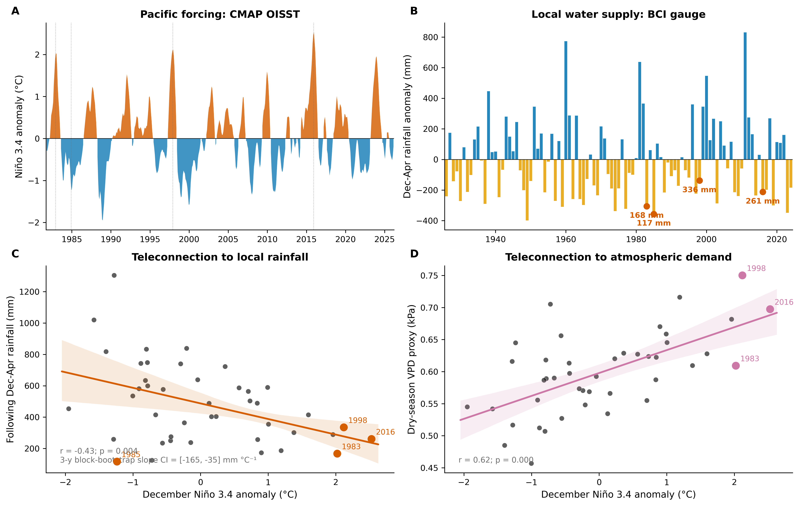

# CMAP BCI-EDGE Notebooks

Two notebooks demonstrating the Simons CMAP Python API (`pycmap`) and a cross-scale BCI case study.

The API notebook provides a short tour of programmatic data discovery, retrieval, and integration in CMAP. The case-study notebook combines Pacific SST, ERA5 atmospheric data, and Barro Colorado Island forest observations to examine climate variability across environmental and ecological scales.



*ENSO variability and its relationship to BCI rainfall and atmospheric drying demand.*

## Installation

Create and activate the Conda environment:

```bash
conda env create -f environment.yml
conda activate bci
```
Then start JupyterLab:

```bash
jupyter lab
```

Get a CMAP API key from the [CMAP API Key Management page](https://simonscmap.com/apikeymanagement).

Use the API key when initializing `pycmap` in the notebooks.


